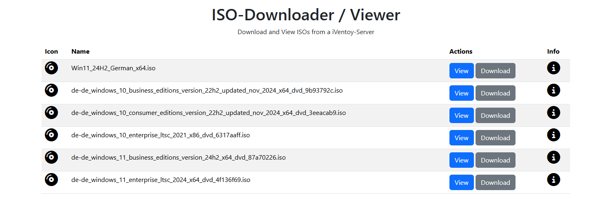
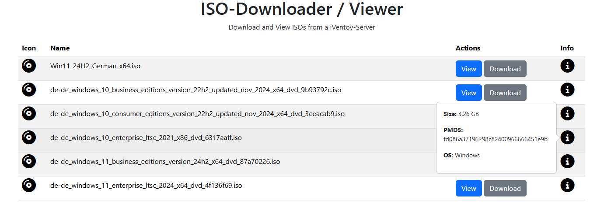
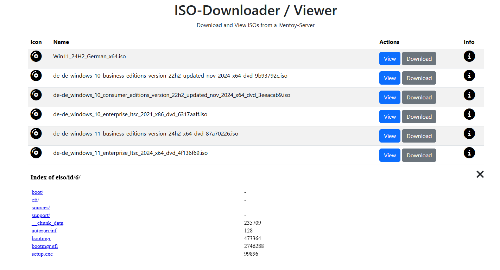

# iVentoy Dashboard

A small Node.js dashboard to manage ISO images on your iVentoy server.
It displays all available ISOs, allows uploads and uses the iVentoy JSON API.

## Features

- List all ISOs found on the server
- Upload new ISOs
- View ISO contents through the iVentoy web UI
- Download individual ISO files

## Requirements

- Node.js v18 or newer
- An existing [iVentoy](https://www.iventoy.com/) installation

## Installation

Clone the repository on the server that runs iVentoy and install the dependencies:

```bash
git clone https://github.com/craeckor/iventoy-dashboard.git
cd iventoy-dashboard
npm install
```

Create a `.env` file based on the provided example and adjust the values for your environment:

```bash
cp .env.example .env
# edit .env to match your iVentoy installation
```

Start the application using Node.js:

```bash
npm start
```

The dashboard will listen on the port specified in `.env` (default `3000`).
Open `http://<server-ip>:3000` in your browser to access it.  
Optionally copy `default.conf` to your Nginx configuration directory if you want to proxy the app behind Nginx.

## Development

The `public/` folder contains all frontend files. During development you can simply run:

```bash
npm start
```

and edit the files in `public/` or `server.js`. Changes take effect after restarting the Node process.

## Screenshots

Screenshot 1:



Screenshot 2:



Screenshot 3:



## License

[GNU GENERAL PUBLIC LICENSE 3](LICENSE)
